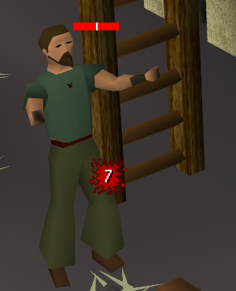

# Health Threshold Indicators

Draws marks at chosen HP levels on an NPC's health bar.



Marks are configured per NPC and drawn on the health bar the game already displays above it. A mark
can be a percentage (50%), an exact HP value (275), or a repeating interval (every 25%).

## Features

- **Per-NPC rules.** Match by name, or by a regular expression such as `(?:Vorkath|Zulrah)`.
- **Four kinds of mark:** `%`, `HP`, `Every %`, `Every HP`.
- **A color per mark,** set individually.
- **Marks sit on the real bar,** including wide boss bars, and disappear when the bar does.
- **Import and export** your setup as JSON through the clipboard. Importing lets you pick which rules to take, and flags any that would replace one you already have.

## Setting it up

1. Open the sidebar (the health bar icon) and click **Add NPC**.
2. Type the NPC's name as it appears in game, for example `Alchemical Hydra`. Names are matched with
   a case-insensitive regular expression, so `(?:Vorkath|Zulrah)` covers two bosses with one rule and
   `.*Hydra` covers every hydra. The field turns red while the pattern is invalid.
3. Click **Add marker**, then set a value, choose `%` or `HP`, and click the swatch to pick a color.

Everything saves as you edit. The plugin ships with no rules; the presets below are a starting point.

## Settings

| Setting | Default | What it does |
|---|---|---|
| Mark width | 1 | Width of each mark, in pixels. |
| Hide passed marks | off | Stops drawing a mark once health drops past it, leaving only what's ahead. |
| Advanced drawing mode | on | Finds each health bar in the drawn frame and places marks exactly on it. See below. |
| Debug logging | off | Logs mark placement to the client log, for reporting alignment problems. |

### Advanced drawing mode

The game doesn't expose where it draws a health bar, so the position has to be worked out from the
NPC's position and the camera. That calculation is accurate to about a pixel, but it drifts while the
camera moves, and it can't know a bar's real width.

With advanced drawing mode on, the plugin instead looks for the bar in the frame the client has just
drawn, in a small window around the calculated position, and places the marks on what it finds. That
makes the marks exact, handles boss bars of any width, and hides the marks when the game hides the bar.
Marks are only drawn on a bar it has found, so a bar it doesn't recognise, such as a shield bar in
another color, gets no marks rather than misplaced ones.

This is the default because it costs nothing noticeable: benchmarked at 1.6 microseconds per frame
for one NPC and under 60 microseconds for fifty, which is well inside a single frame's budget. Turn
it off if you use a custom health bar style it can't recognise, which otherwise leaves you with no marks.

## Presets

Copy any of this, then click **Import** in the sidebar. You'll get a list to choose from; rules whose
name you already use are marked, and importing one replaces yours rather than adding a duplicate.

Colors in this preset are used consistently, so a mark's color tells you what kind of moment it is:

| Color | Means |
|---|---|
| Blue | Phase change or new form |
| Yellow | Summons adds, healers or minions |
| Orange | Scripted special attack |
| Red | Enrage, or attack speed increase |
| Grey | Shielded, invulnerable, or final stand |
| Pink | Finish off with a Slayer item |

Change any of them after importing.

<details>
<summary>Preset (26 bosses, 5 Slayer monsters)</summary>

```json
[
  {"name": "Alchemical Hydra", "markers": [{"value": 75, "percent": true, "repeating": false, "color": -12737025}, {"value": 50, "percent": true, "repeating": false, "color": -12737025}, {"value": 25, "percent": true, "repeating": false, "color": -47814}]},
  {"name": "Cerberus", "markers": [{"value": 400, "percent": false, "repeating": false, "color": -10742}, {"value": 200, "percent": false, "repeating": false, "color": -24822}]},
  {"name": "Nex", "markers": [{"value": 80, "percent": true, "repeating": false, "color": -12737025}, {"value": 60, "percent": true, "repeating": false, "color": -12737025}, {"value": 40, "percent": true, "repeating": false, "color": -12737025}, {"value": 20, "percent": true, "repeating": false, "color": -12737025}]},
  {"name": "Phantom Muspah", "markers": [{"value": 75, "percent": true, "repeating": false, "color": -24822}, {"value": 50, "percent": true, "repeating": false, "color": -24822}, {"value": 127, "percent": false, "repeating": false, "color": -3618616}]},
  {"name": "Abyssal Sire", "markers": [{"value": 50, "percent": true, "repeating": false, "color": -12737025}, {"value": 35, "percent": true, "repeating": false, "color": -47814}]},
  {"name": "Dusk", "markers": [{"value": 55, "percent": true, "repeating": false, "color": -12737025}]},
  {"name": "Dawn", "markers": [{"value": 55, "percent": true, "repeating": false, "color": -12737025}]},
  {"name": "Vet'ion.*|Calvar'ion.*", "markers": [{"value": 50, "percent": true, "repeating": false, "color": -10742}]},
  {"name": "Araxxor", "markers": [{"value": 255, "percent": false, "repeating": false, "color": -47814}]},
  {"name": "Vardorvis", "markers": [{"value": 570, "percent": false, "repeating": false, "color": -24822}, {"value": 33, "percent": true, "repeating": false, "color": -47814}]},
  {"name": "The Leviathan", "markers": [{"value": 20, "percent": true, "repeating": false, "color": -47814}]},
  {"name": "The Whisperer", "markers": [{"value": 80, "percent": true, "repeating": false, "color": -24822}, {"value": 55, "percent": true, "repeating": false, "color": -24822}, {"value": 30, "percent": true, "repeating": false, "color": -24822}]},
  {"name": "The Hueycoatl", "markers": [{"value": 50, "percent": true, "repeating": false, "color": -3618616}]},
  {"name": "TzTok-Jad", "markers": [{"value": 150, "percent": false, "repeating": false, "color": -10742}]},
  {"name": "TzKal-Zuk", "markers": [{"value": 480, "percent": false, "repeating": false, "color": -10742}, {"value": 240, "percent": false, "repeating": false, "color": -47814}]},
  {"name": "Sol Heredit", "markers": [{"value": 90, "percent": true, "repeating": false, "color": -12737025}, {"value": 75, "percent": true, "repeating": false, "color": -12737025}, {"value": 50, "percent": true, "repeating": false, "color": -12737025}, {"value": 25, "percent": true, "repeating": false, "color": -12737025}, {"value": 10, "percent": true, "repeating": false, "color": -47814}]},
  {"name": "Yama", "markers": [{"value": 66.6, "percent": true, "repeating": false, "color": -12737025}, {"value": 33.3, "percent": true, "repeating": false, "color": -12737025}]},
  {"name": "Doom of Mokhaiotl", "markers": [{"value": 75, "percent": true, "repeating": false, "color": -3618616}]},
  {"name": "The Nightmare|Phosani's Nightmare", "markers": [{"value": 66.6, "percent": true, "repeating": false, "color": -12737025}, {"value": 33.3, "percent": true, "repeating": false, "color": -12737025}]},
  {"name": "Maiden of Sugadinti", "markers": [{"value": 70, "percent": true, "repeating": false, "color": -10742}, {"value": 50, "percent": true, "repeating": false, "color": -10742}, {"value": 30, "percent": true, "repeating": false, "color": -10742}]},
  {"name": "Akkha", "markers": [{"value": 80, "percent": true, "repeating": false, "color": -10742}, {"value": 60, "percent": true, "repeating": false, "color": -10742}, {"value": 40, "percent": true, "repeating": false, "color": -10742}, {"value": 20, "percent": true, "repeating": false, "color": -10742}]},
  {"name": "Xarpus", "markers": [{"value": 25, "percent": true, "repeating": false, "color": -12737025}]},
  {"name": "Sotetseg", "markers": [{"value": 66.6, "percent": true, "repeating": false, "color": -24822}, {"value": 33.3, "percent": true, "repeating": false, "color": -24822}]},
  {"name": "Zebak", "markers": [{"value": 85, "percent": true, "repeating": false, "color": -24822}, {"value": 70, "percent": true, "repeating": false, "color": -24822}, {"value": 55, "percent": true, "repeating": false, "color": -24822}, {"value": 40, "percent": true, "repeating": false, "color": -24822}, {"value": 25, "percent": true, "repeating": false, "color": -47814}]},
  {"name": "Verzik Vitur", "markers": [{"value": 35, "percent": true, "repeating": false, "color": -10742}, {"value": 20, "percent": true, "repeating": false, "color": -47814}]},
  {"name": "Branda the Fire Queen|Eldric the Ice King", "markers": [{"value": 35, "percent": true, "repeating": false, "color": -12737025}]},
  {"name": "Gargoyle", "markers": [{"value": 8, "percent": false, "repeating": false, "color": -42286}]},
  {"name": "Zygomite|Ancient Zygomite", "markers": [{"value": 7, "percent": false, "repeating": false, "color": -42286}]},
  {"name": "Rockslug", "markers": [{"value": 4, "percent": false, "repeating": false, "color": -42286}]},
  {"name": "Desert Lizard|Small Lizard", "markers": [{"value": 4, "percent": false, "repeating": false, "color": -42286}]},
  {"name": "Elder custodian stalker", "markers": [{"value": 20, "percent": true, "repeating": false, "color": -24822}]}
]
```

</details>

The Slayer rules mark when monsters like gargoyles and rockslugs can be finished off with their item,
and when elder custodian stalkers start their bleed special.

Bosses whose phases are driven by something other than health are deliberately absent, including
Vorkath (attack count), the Great Olm (disabling hands), and Zulrah (rotation).

## Reporting a problem

1. In the plugin's settings, turn on **Debug logging**.
2. Reproduce the problem. A minute or so is plenty; turn logging off again afterwards.
3. Open the client log, at `%USERPROFILE%\.runelite\logs\client.log` on Windows or
   `~/.runelite/logs/client.log` on macOS and Linux.
4. Include the lines containing `healthindicators debug` in your report. The rest of the log covers
   the whole client and isn't needed.

The first line records the RuneLite version, whether GPU and stretched mode are on, the window size,
and this plugin's settings. After that, each marked NPC gets a line about four times a second, with
the rule it matched, its health, the camera, where the plugin calculated the bar to be, where it
found it, and where the marks went.

A short screen recording of the problem helps a lot, especially with the log lines from the same
moment: the log shows where the plugin thought the bar was, and the video shows where it really was.

## Building

```
./gradlew build     # compile and run the tests
./gradlew run       # start a development client with the plugin loaded
```

## License

BSD 2-Clause. See [LICENSE](LICENSE).
